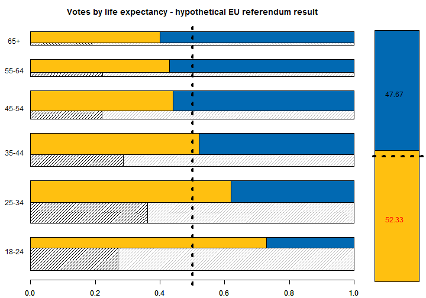

# BrexitAgeWeighted

Analysis of Brexit age-specific voting behaviour - for The Conversation article.

<hr>
This is a 'back of the envelope' calculation of the age-specific voting results of the Brexit referendum using best available estimates to:

* first recreate the referendum results
* then use life expectancy as an alternative vote weight
<hr>

The following data sources were used in this calculation (see `scripts/01-DataImport.R` for code):

* Votes: [Lord Ashcroft Post Vote Poll 24.6.2016](http://lordashcroftpolls.com/2016/06/how-the-united-kingdom-voted-and-why/#more-14746)
* Turnout: [Sky data Tweet 25.6.2916 (YouGov poll?)](https://twitter.com/SkyData/status/746700869656256512)
* Registration: [The quality of the 2014 electoral registers in Great Britain](http://www.electoralcommission.org.uk/__data/assets/pdf_file/0005/169889/Completeness-and-accuracy-of-the-2014-electoral-registers-in-Great-Britain.pdf)
* More registration: [Performance: Voter Registration dashboard](https://www.gov.uk/performance/register-to-vote)
* UK population [ONS population estimates 2015](https://www.ons.gov.uk/file?uri=/peoplepopulationandcommunity/populationandmigration/populationestimates/datasets/populationestimatesforukenglandandwalesscotlandandnorthernireland/mid2015/ukmye2015.zip)
* UK life expectancy [ONS life tables](http://www.ons.gov.uk/file?uri=/peoplepopulationandcommunity/birthsdeathsandmarriages/lifeexpectancies/datasets/nationallifetablesunitedkingdomreferencetables/current/nltuk1214reg_tcm77-414438.xls)

<hr>

To recreate the analysis run:

* `scripts/01-DataImport.R`
* `scripts/02-DataCleanUp.R`
* `scripts/03-Functions.R`
* `SCRIPTS/04-FinalPlotAndResults.R`


<hr>

For conveniece the table with all the results is saved separetely in `data/FinalTable.csv` and reproduced below:


```
##   age.group    count registered.prop turnout.prop remain.prop years.left
## 1     18-24  5878472       0.8178976        0.400        0.73  354889646
## 2     25-34  8822757       0.8232843        0.620        0.62  460441013
## 3     35-44  8378302       0.9005604        0.725        0.52  355694721
## 4     45-54  9196082       0.9385801        0.770        0.44  305099646
## 5     55-64  7452381       0.9483274        0.810        0.43  181974128
## 6       65+ 11611167       0.9616406        0.830        0.40  147515796
```

And here is the *alternative system* result:


